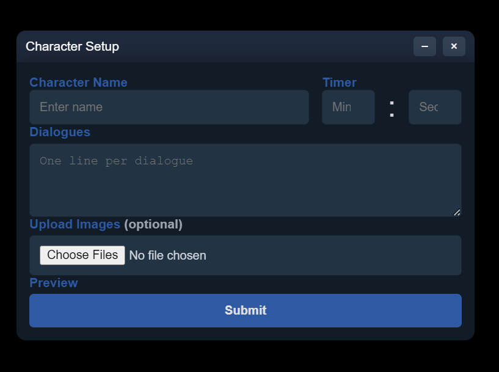
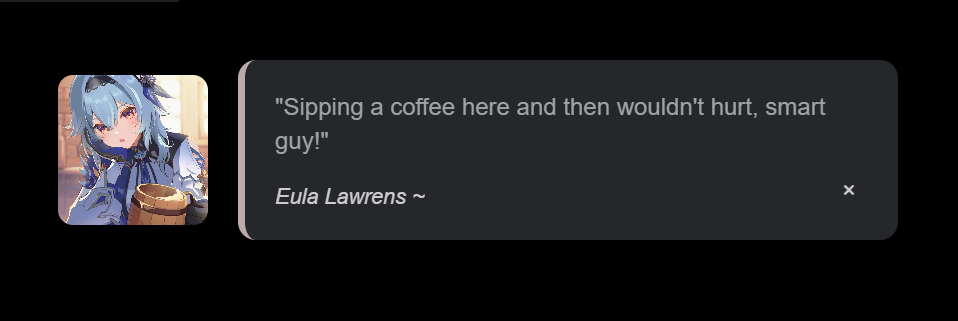

<p align="center">
  <br>
<br>
  <span style="font-size: 1.2em;">👋 Welcome to <strong>R2C</strong> 🚀</span>
</p>

---

> 🧠 A desktop companion app built with <strong>Electron</strong> that brings characters to life on your desktop through dialogue and engaging visuals.

<p align="center">
  <a href="#demo">🔹 View Demo</a> &nbsp;·&nbsp;
  <a href="#bug">🐞 Report Bug</a> &nbsp;·&nbsp;
  <a href="#feature">💡 Request Feature</a>
</p>
<br>

## 📚 Table of Contents

- [👋 Introduction](#-introduction)
- [🖼️ Features](#-features)
- [🛠️ Installation](#️-installation)
- [🎮 Usage](#-usage)
- [🧩 Demo](#-demo)
- [🗺️ Roadmap](#️-roadmap)
- [📄 License](#-license)
<br>
<br>

## 👋 Introduction

**R2C** is my very first project that I’ve ever officially published — and I couldn't be more excited to share it with the world! 🎉

Built with 💻 **Electron**, this desktop companion app is more than just a code experiment. It's a personal milestone, representing the transition from tinkering with ideas to actually launching something real and usable. Whether you're a developer curious about desktop apps or someone who just enjoys digital companions, **R2C** was made with heart, a lot of learning, and plenty of late-night debugging sessions. 🌙

While it's not perfect, I’m proud to finally share it. I hope this project of mine brings you at least a of personality and fun going through your desktop! just like it did to mine! 


## 🧸 Features

- 🧍 Customizeable Characters — Add a name, timer, and dialogues to personalize your companion.

- 💬 Dynamic Dialogue Display — Characters speak at set intervals with stylized popups.

- 🖼️ Optional Visuals — Upload image assets to make your character visually come alive.

- 💻 Desktop Integration — Lightweight and always-on-top windows, perfect for background interaction.

- 🔁 Looping continuously — it gives off the feel of a reactive presence.

## 🛠️ Installation

📦 **Download Prebuilt**

> Feeling troubled downloading VS Code and whatnot? Don't worry! Just download the app!

- 🔗 [Download R2C for Windows (.exe)](https://github.com/Purwao/R2C/releases/tag/v1.3.2)
  *(macOS/Linux support not available yet)*

🧑‍💻 Or Run From Source (For Devs)

If you're another devs and want to play with the source:


Clone the project
```bash
git clone https://github.com/Purwao/R2C.git
```

Install dependencies
```bash
npm install
```


To run tests, run the following command
```bash
npx electron .
```

## 🎮 Usage

Getting started with **R2C** is simple! Follow these steps to bring your desktop companion to life:

1. **Launch the App**  
   Open the R2C executable — no installation or setup required.

2. **Fill in the Character Info**
   - 🏷️ **Character Name**: Give your companion a name.
   - 💬 **Dialogues**: Write one dialogue per line. These lines will appear randomly on a loop.
   - ⏱️ **Timer**: Set how frequently your character speaks (in minutes and seconds).
   - 🖼️ **Upload Image** (optional): Add a visual to give your character a face.

   > ⚙️ *Note: The character setup form is still pretty basic — improvements to layout and UX are planned in future updates!*

3. **Click Submit**  
   Your character will appear on-screen, chatting at regular intervals.

> 💡 **Tip**: You can create multiple companions btw — just repeat the process with different settings for each one!

## 🧩 Demo

Here’s how it works in action:
<p align="center">
  

</p>
> 🧪 *The UI is still evolving! Do expect cleaner visuals and better customization options in future versions.*

## 🗺️ Roadmap

Here are some planned improvements and future features for **R2C**:

- [ ] 🧼 **UI/UX Enhancements**  
  Improve the character setup form for a more intuitive experience (e.g., field grouping, better spacing, saving data, positioning, etc).

- [ ] 🧠 **Dialogue Variations**  
  Support for time-based or generated dialogues (e.g., "morning quotes", "random jokes", etc).

- [ ] 🧩 **Character Profiles**  
  Save and load different characters with unique settings and visuals.

- [ ] 🌐 **Cross-Platform Support**  
  Add downloadable builds for macOS and Linux. Do not expect in the near future.

- [ ] ⚙️ **Settings Menu**  
  Global settings like window opacity, position locking, and startup behavior.

- [ ] 💬 **Speech Effects**  
  Add typing animations or optional voice playback (TTS).


> ✅ Have suggestions? Feel free to open a [Feature Request] or [Issue]!

## ⚖️ License

This project is licensed under the [MIT License](./LICENSE).

Feel free to use, modify, and distribute it — just be sure to include the original license.  
No warranties are provided. Use at your own risk.

© 2025 [Purwao]

### ✍️ Author
Developed with 💻 and ❤️ by **[Purwa]**  
🔗 [Your GitHub](https://github.com/Purwao)  
📧 Contact: purwaarda51@example.com